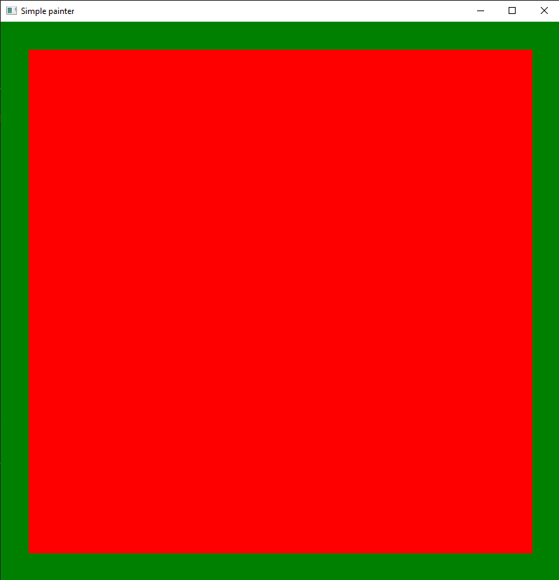
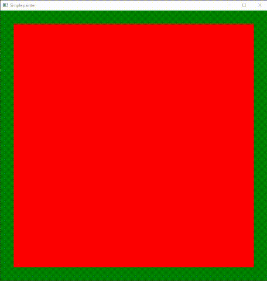
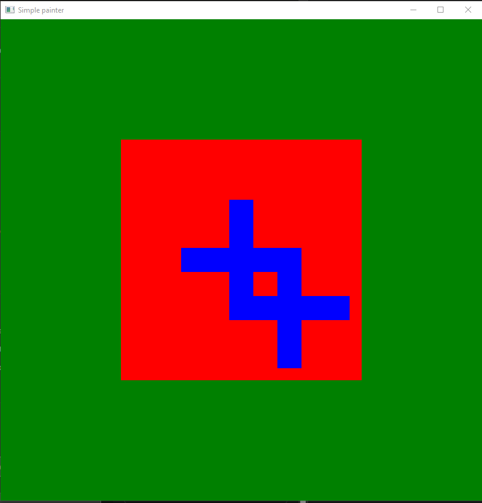

## Go Paint

### An Interactive Guide to the Go Painting Application

---

### Development Team:

- Illia Kornyk
- Anastasya Holubenko
- Vadym Didur
- Andriy Tarasiuk

### Usage Instructions:

1. Begin by cloning the repository to your system:

```bash
$ git clone https://github.com/forestgreen18/event-loop.git
```

2. Change directory to the cloned repository:

```bash
$ cd event-loop/
```

3. Start the application:

```bash
$ go run cmd/painter/main.go
```

4. In your web browser, navigate to the `event-loop\script\index.html` file.

5. Execute the provided scripts or enter your own commands to interact with the painting interface.
   For instance:

```
white
update
```

This sequence will set the background to white.

### **Command Glossary:**

1. **white**
   - Sets the background to white.
2. **green**
   - Changes the background to green.
3. **update**
   - Refreshes the painting interface.
4. **bgrect x1 y1 x2 y2**
   - Draws a black rectangle with specified corner coordinates. Only the most recent rectangle is shown.
5. **figure x y**
   - Renders a cross figure at the specified coordinates over the background.
6. **move x y**
   - Translates the object horizontally by X and vertically by Y.
7. **reset**
   - Clears all background and figures, reverting the background to black.

## Example Scripts

1. **Verdant Frame**
   This script executes the following commands:

```
green
bgrect 0.05 0.05 0.95 0.95
update
```

Visual Result:


2. **Figure's Journey**
   Click on "Diagonal movement script" button at web intercace.

Visual Result:


## Crafting Custom Scripts

Create your own command sequences to manipulate the painting canvas:

```
white
bgrect 0.25 0.25 0.75 0.75
figure 0.5 0.5
green
figure 0.6 0.6
update
```

Visual Result:

